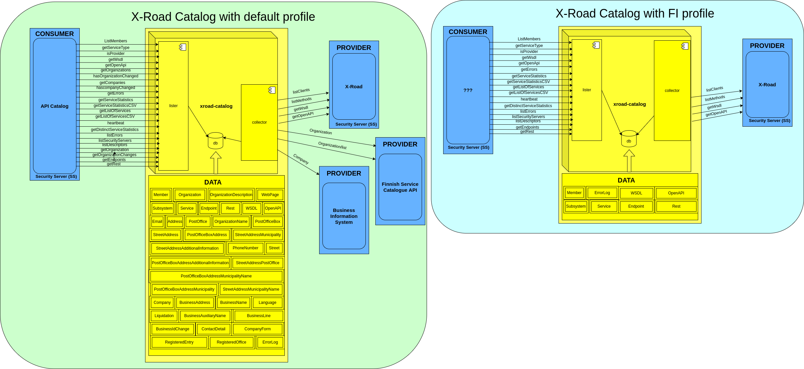

# X-Road Catalog

## About the repository 

This repository contains information about the X-Road Catalog, its source code, development, installation and documentation.

## Introduction to X-Road Catalog

X-Road Catalog is an [X-Road](https://github.com/nordic-institute/X-Road/) extension that collects information, more 
specifically members, subsystems and services, from an X-Road ecosystem and provides a REST and SOAP interfaces to read 
the data.

X-Road Catalog can be used together with an additional API Catalog component - a web portal that contains descriptions of all the 
services available in the ecosystem. The primary purpose of the API Catalog is to provide a user-friendly channel to 
search and discover available services. The API Catalog is targeted at both business and technical users.

When services are connected to X-Road, their service descriptions are published on the Security Server by the Security 
Server administrator. The service descriptions can then be accessed using a [service discovery mechanism](https://docs.x-road.global/Protocols/pr-mrest_x-road_service_metadata_protocol_for_rest.html) 
provided by X-Road. However, the mechanism is very technical and requires direct access to the Security Server's 
messaging interface. Also, getting a list of all services available in the ecosystem would require querying each 
Security Server separately. Therefore, a more user-friendly API Catalog is needed.

X-Road Catalog is used to automate the collection of the service metadata from the Security Servers. In that way, the 
descriptions need to be maintained in a single place only, and all the changes in the source are automatically updated 
to the API Catalog. Nevertheless, additional metadata must be manually added and maintained on the API Catalog by a service 
administrator representing the organisation owning the service. The metadata may include any information related to the 
service and its use, e.g., a more detailed description of the data set, terms and conditions, contact information, 
pricing information, SLAs, etc.

## Architecture

The X-Road Catalog software consists of three modules:

- [xroad-catalog-collector](xroad-catalog-collector/README.md)
  * Collects information from the X-Road ecosystem (possibly also from external APIs) and stores it to the postgresql database. 
  * Implemented using concurrent Akka actors. 
- [xroad-catalog-lister](xroad-catalog-lister/README.md)
  * SOAP and REST interfaces that offer information collected by the Collector. 
  * Can be used as an X-Road service (X-Road headers are in place).
- [xroad-catalog-persistence](xroad-catalog-persistence/README.md)
  * Library used to persist and read persisted data. Used by the `xroad-catalog-collector` and `xroad-catalog-lister` modules.
  

## Version management

For versioning, [GitHub Flow](https://guides.github.com/introduction/flow/) is used with the following principles:

* Anything in the master branch is deployable.
* To work on something new, create a branch off from master and given a descriptive name(e.g., `new-oauth2-scopes`).
* Commit to that branch locally and regularly push your work to the same named branch on the server.
* When you need feedback or help, or you think the branch is ready for merging, open a pull request.
* After someone else has reviewed and signed off on the feature, you can merge it into master.
* Once it is merged and pushed to master, you can and should deploy immediately.

## Tools

Running the X-Road Catalog software requires Linux (Ubuntu or RHEL). If you are using some other operating system 
(e.g. Windows or macOS), the easiest option is to first install Ubuntu 20.04 or RHEL 7.0 into a virtual machine.

*Required for building*
* OpenJDK / JDK version 11
* Gradle

*Recommended for development environment*
* Docker (for deb/rpm packaging)
* [LXD](https://linuxcontainers.org/lxd/)
  * for setting up a local X-Road instance
* Ansible
  * for automating the X-Road instance installation

The development environment should have at least 8GB of memory and 20GB of free disk space (applies to a virtual 
machine as well), especially if you set up a local X-Road instance.

## Credits

* X-Road Catalog was originally developed by the [Finnish Digital Agency](https://dvv.fi/en) during 2016-2023.
* In 2023 it was agreed that [Nordic Institute for Interoperability Solutions (NIIS)](https://www.niis.org/) takes maintenance responsibility.